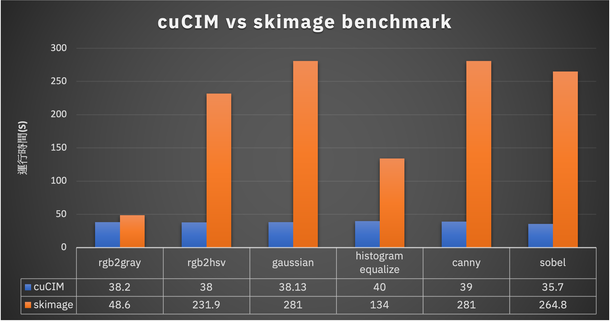

# Rapids-best-practice
This repo is best practice with the NVIDIA GPU data science package RAPIDS. 


## cuCIM

cuCIM is a GPU-accelerated image processing library for Python. [Official documentation](https://docs.rapids.ai/api/cucim/stable/index.html).
### cuCIM vs skimage ([Benchmark Article](https://medium.com/@NeroHin/gpu-can-help-%E7%94%A8-gpu-%E5%8A%A0%E9%80%9F%E5%BD%B1%E5%83%8F%E8%99%95%E7%90%86%E6%B5%81%E7%A8%8B-%E5%88%9D%E6%8E%A2-nvidia-cucim-library-ff202df664a4))


> cuCIM is faster than skimage with genral image processing.


### How to install

```shell
conda create -n cucim python=3.8 -r requirements.txt
conda activate cucim
```